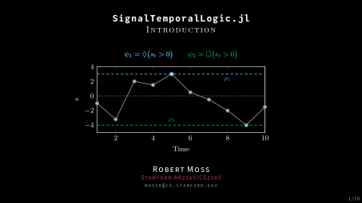

# SignalTemporalLogic.jl Slides

**Stanford University**: _AA228V/CS238V Validation of Safety-Critical Systems_.

See PDF at [`output/main.pdf`](./output/main.pdf).

<p align="center">
  <kbd>
    <a href="./output/main.pdf">
      
    </a>
  </kbd>
</p>

## Installation

1. Clone repo and `cd` to the folder.
1. Install lexer and style:
```
python -m venv stl
source stl/bin/activate
pip install --upgrade git+https://github.com/sisl/pygments-julia#egg=pygments_julia
pip install --upgrade -e pygments-style-algfordmdark
```

- Make sure [`pythontex`](https://github.com/gpoore/pythontex) is installed.
- Make sure `julia` is installed.

To compile, run:
```
latexmk
```

This is an updated fork of [mossr/julia-tufte-beamer](https://github.com/mossr/julia-tufte-beamer).