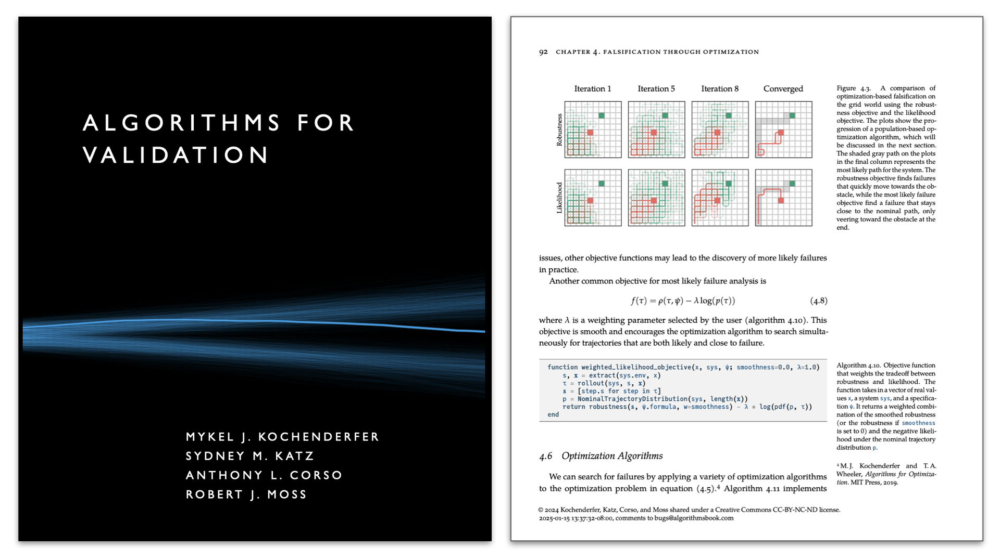

# Julia in Academia Slides

**JuliaCon 2025**: _Julia in Academia: Textbooks, Stanford Courses, and the Future_.

Robert Moss (_Stanford University_)

See the abstract for the talk [here](https://pretalx.com/juliacon-2025/talk/YT7AVS/).

<p align="center">
  <kbd>
    <a href="./output/main.pdf">
      
    </a>
  </kbd>
</p>

## Resources

- Textbook template: [sisl/tufte_algorithms_book](https://github.com/sisl/tufte_algorithms_book)
- Slides template: [mossr/julia-tufte-beamer](https://github.com/mossr/julia-tufte-beamer)
- Interactive papers (`PlutoPapers.jl`): [mossr/PlutoPapers.jl](https://github.com/mossr/PlutoPapers.jl)

## Installation

1. Clone repo and `cd` to the folder.
1. Install lexer and style:
```
python -m venv stl
source stl/bin/activate
pip install --upgrade git+https://github.com/sisl/pygments-julia#egg=pygments_julia
pip install --upgrade -e pygments-style-algfordmdark
```

- Make sure [`pythontex`](https://github.com/gpoore/pythontex) is installed.
- Make sure `julia` is installed.

To compile, run:
```
latexmk
```

This is an updated fork of [mossr/julia-tufte-beamer](https://github.com/mossr/julia-tufte-beamer).
